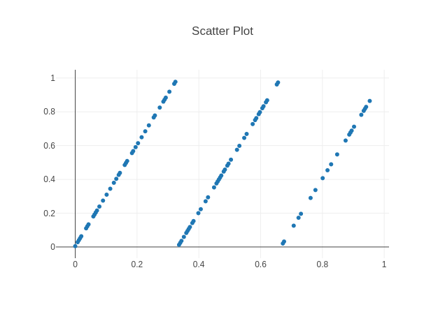
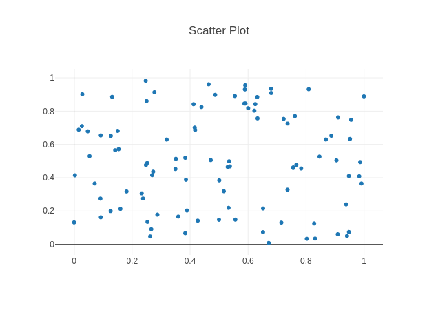

# random-graphics
The app generates random numbers in the interval [0,1[; the resulting numbers are taken in pairs and plotted in a x,y graph.

Mersenne Twister generator is based on  banksean javascript Mersenne Twister implementation https://gist.github.com/banksean/300494 .

Demo https://matteo.mortaro.it/post/2023-09-05_random_graphics/

To obtain instances of random numbers one can choose one of the standard routines ran1, ran2 or ran3 
(Numerical Recipes in C - second edition), the Mersenne Twister generator, or one can define from input 
the coefficients of a linear congruential generator. Recall that the meaning of the coefficients is as follows:

Zi+1=(a*Zi +c) mod m

To obtain numbers belonging to [0,1[ one divides Zi by the m term.

## Notes

In order to use the routines ran1, ran2, ran3 it is necessary to set a negative seed value: this is needed to allow the correct initialization of the generator, after which seed is reversed in sign.

Regarding the definition of the parameters of the linear congruential generator, the following examples are suggested:

## Example 1

seed=1;
a=3;
c=5;
m=1024;

The first example highlights the correlation problem that can occur in linear congruential random number generators. Obviously, this is an extreme case.

## Example 2

seed=1;
a=16807;
c=0;
m=2147483647;

This example was proposed by Park and Miller as a minimum quality standard for a random number generator.
